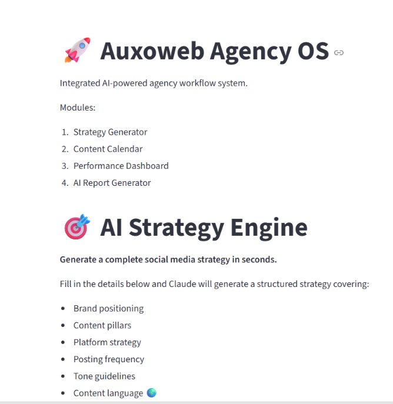
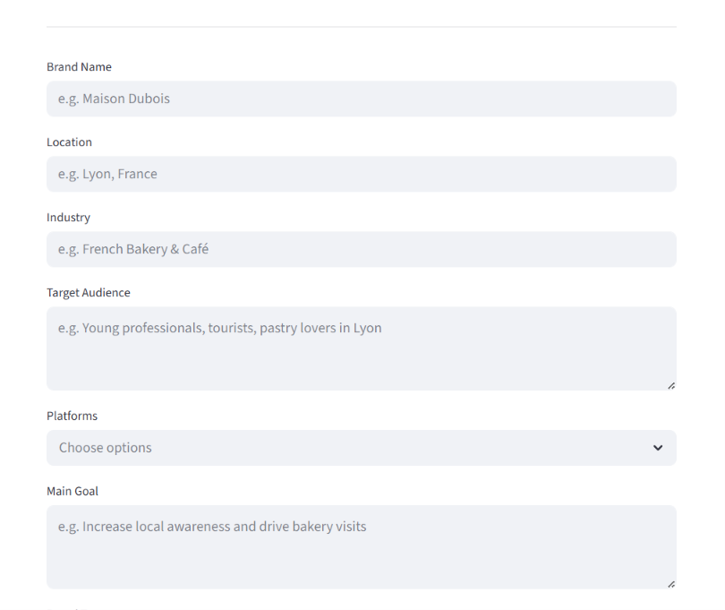
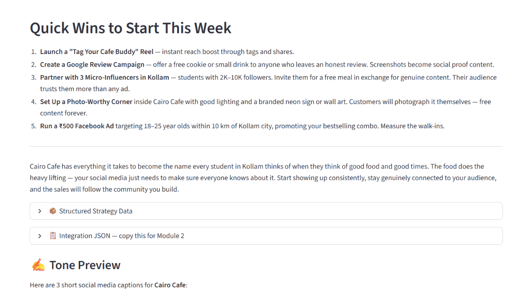
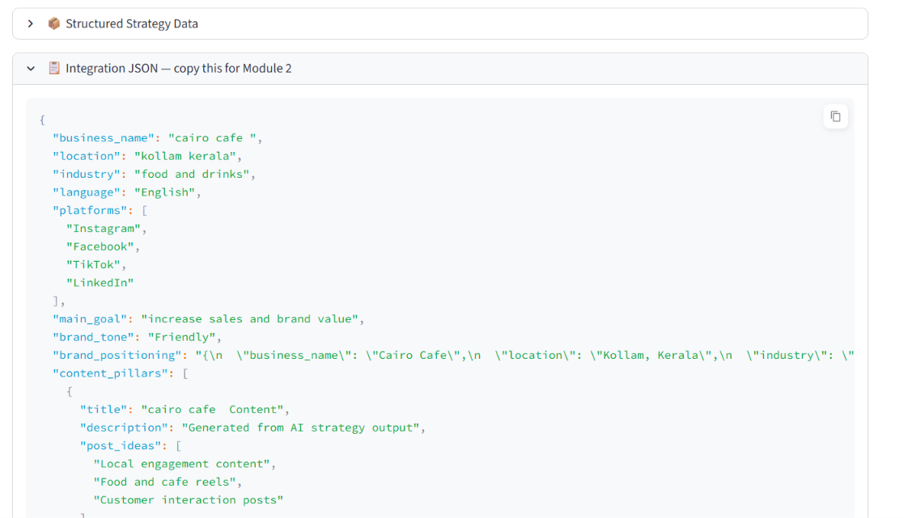

# AI Social Media Strategy Tool - Module 1 AI Strategy Engine

Built during AI Development Internship at Auxoweb Studio (April-May 2026)

## My Module
Module 1 generates a complete AI-powered social media strategy using Claude AI based on client business details. The system creates brand positioning, content pillars, platform strategies, posting schedules, and tone guidelines in the client's preferred language.

## Tech Stack
- Python
- Streamlit
- Claude API
- Anthropic SDK

## Features
- AI-generated social media strategy
- Multi-language content generation
- Structured JSON export for Module 2 integration
- Dynamic industry-based UI themes
- Tone preview caption generator
- Error handling and validation system

## Screenshots

# What I Learned
- API integration and prompt engineering
- JSON parsing and structured AI outputs
- Streamlit session state management
- Error handling for production workflows
- Module-to-module integration pipelines

Built for: Auxoweb Studio, Brno, Czech Republic
